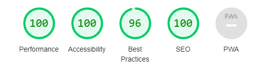

# Test Your Knowledge: JavaScipt, HTML, CSS

[This is a link to the live website](https://hazelhawadi.github.io/Test-Your-Knowledge/)

## Table Of Contents
- [Project Overview](#project-overview)
- [Goal](#goal)
- [Usage](#usage)
- [Features](#features) 
  * [Home Page](#home-page)
  * [Quiz Page](#quiz-page)
  * [Result Page](#result-page)
  * [Color Scheme](#color-scheme)
  * [Responsive layout](#responsive-layout)
- [Wireframes](#wireframes) 
- [Existing Features](#existing-features)
- [Future Features](#future-features)
- [UX Design](#ux-design)
    * [User Stories](#user-stories)
- [Testing](#testing)
  * [User Story Testing](#user-story-testing)
  * [Feature testing](#feature-testing)
- [Validator Testing](#validator-testing)
- [Google Lighthouse](#google-lighthouse)
- [Feature testing](#feature-testing)
- [Unfixed Bugs](#unfixed-bugs)  
- [Deployment](#deployment)
- [Clone A Repository](#how-to-run-the-project-locally)
- [Download A Repository](#download-the-repository) 
- [Technologies](#technologies)
- [Credits](#credits)  
- [Acknowledgements](#acknowledgements) 

## Project Overview
The Test Your Knowledge Quiz is designed to assist students and anyone interested in learning and understanding the basics of JavaScript, HTML, and CSS. This interactive quiz allows users to test their knowledge through multiple-choice questions and instantly receive feedback on their answers. Whether you're preparing for an assessment or simply interested in advancing your knowledge, this quiz provides an engaging way to learn and assess your understanding of these subjects.

## Goal
The goal of the quiz is to help users prepare for assessments and deepen their understanding of JavaScript, HTML, and CSS concepts. By engaging in this quiz, users can assess their knowledge in a practical setting and identify areas for further study.

## Usage
**Once the quiz is running, users can:** 

- Enter their name to start the questions.
- Navigate through various questions on JavaScript, HTML, and CSS.
- Answer questions and receive immediate feedback.
- See their progress during the quiz.
- Get their final score at the end of the quiz with their name on it.
- Retake the quiz with shuffled questions if they are not satisfied with their score or for more practice and they get the option to go back home to stop the quiz.

## Features
### Home Page

- Users are required to enter their name and click Take Quiz to start the quiz. The name is stored in the browser's local storage, allowing for a personalized experience where the user's name is displayed on the result page along with their score.

### Quiz Page

- Quiz Title: "Test Your Knowledge: JavaScript, HTML, CSS".
- Start Button: Allows users to initiate the quiz.
- Question Area: Presents questions related to JavaScript, HTML, and CSS.
- Answer Choices: Multiple-choice options for each question to choose from.
- Score Area: Displays the progress.
- Feedback: Provides immediate feedback on correct and incorrect answers.
- Next Button: Allows users to go to the next question only after selecting an answer.

### Result Page

- Final Score: Displays the user's final score.
- Restart Quiz Button: Option to retake the quiz for more practice.
- Go Home Button: Option for user to go back to the Home page and enter a new username if they wish to start the quiz with a different name.

### Color Scheme

**Why These Colors?**
- The combination of blue, gray, green, and red creates a great color palette. It is visually appealing and maintains user interest.
- The colors are used strategically to differentiate between actions and  information, providing a clear user interface.
- The colors (green and red) provide immediate visual feedback.
- The selected colors ensure a consistent look throughout the quiz, making it easy to navigate for users of all ages and backgrounds.

### Responsive Layout
The quiz is designed to be responsive on all screen sizes, ensuring the best user experience from mobile devices to desktops. Media queries are used to adjust the layout and styling for different screen sizes:
- Adjustments for large or landscape phones (576px and up).
- Enhanced layout and font sizes for tablets and larger screens (768px and up).
Tailored styling for large devices such as laptops and desktops (992px and up).

## Wireframes
### Home Page

### Quiz Page

### Result Page

### Existing Features
- Home Page: Requires a user to enter their name before starting the quiz.
- Quiz Area: Allows users to answer multiple-choice questions on JavaScript, HTML, and CSS.
- Progress Tracking: Displays a progress bar to indicate how many questions have been answered.
- Instant Feedback: Provides immediate feedback on whether answers are correct or incorrect.
- Score Display: Shows the user's name, their score and the total number of questions attempted.
- Restart Quiz: Allows users to restart the quiz after completion to try again.
- Stop Quiz: allows the user to end game and go back home to the username page.

### Future Features
- Leaderboard: Create a leaderboard to track and display high scores.
- Timer: Add a timer to challenge users to answer questions within a specific time limit.
- More Topics: Expand the quiz to cover additional topics and languages.
- Customization: Allow users to customize quiz settings, such as difficulty level or topic selection.

## UX Design

### Target Audience
The Test Your Knowledge quiz is designed for students and anyone interested in learning and understanding the basics of JavaScript, HTML, and CSS.

## User Stories
### As a first-time user:
- I want to start the quiz by entering my name.
- I want to answer questions covering JavaScript, HTML, and CSS.
- I want to initialize the quiz by clicking the start button.
- I want to be able to see the feedback on my answers.
- I want to be able to see my progress throughout the quiz.
- i want to see the score at the end of the quiz.
- I want the option to retake the quiz with shuffled questions to improve my score or simply for more practice.
- I want the feedback message contain my name.
- I want to go back to home page and change my name if I want to.
- I want to be able to use the application across different screen sizes.

### As a returning user:
- I want to be able to see a leaderboard to track and display high scores.
- I want a timer to challenge us users finish the quiz within a certain amount of time.
- I want more questions, languages and topics to be covered.
- I want to be able to customize the quiz settings, such as selecting difficulty level or topic.

## Testing 

### User Story Testing

### Feature Testing
- Home Page: Verified the name input and "Take Quiz" button functionality.
- Quiz Page: Tested the display of questions, answer selection, feedback, and progress tracking.
- Result Page: Confirmed the display of the final score and functionality of the "Restart Quiz" and "Go Home" buttons.

## Validator Testing
### CSS : [Jigsaw Validator](https://jigsaw.w3.org/css-validator/)
**No Bugs Found**

### HTML : [W3C Validator](https://validator.w3.org/)
### Quiz
**1 Unfixed Bug**

Got an error on the retake button. No changes have been made.

### Home Page
**No Bugs Found**

### javascript : [Javascript Validator](https://jshint.com/)

A comment of the version name was added and no errors were returned for both files, just the questions variable which was called in a separate file.

### Google Lighthouse 
### Home Page
**Desktop**

**Mobile**

### Quiz Page
**Desktop**

**Mobile**

### Results Page
**Desktop**

**Mobile**

### Unfixed Bugs
- 1 unfixed bug found [quiz File](#quiz)

## Deployment

- **This project was deployed to GitHub pages. The steps to deploy are as follows:**

    - In the GitHub go to repository.
    - From the list of repositories, select "Test Your Knowlwdge"
    - Select **Settings**
    - Select **Pages** which is in the left side menu
    - On Branch, select **Main**
    - Leave the folder as  **/root**
    - Click **save**
    - A message that the website is ready to be deployed will appear,efresh the page and the link to the deployed site will be available in a green sub-section on the top of the page,
    - Refresh the page and the link to the deployed website will be available in a highlighted sub-section on the top of the page.
    - Click on the link to go to the live site.

[A link for the live website](https://hazelhawadi.github.io/Test-Your-Knowledge/)

## How to run the project Locally
- **Clone the repository as follows:**
    - Go to GitHub **Repositories**.
    - select Test Your Knowlwedge
    - Click the **Code** drop-down menu and click the HTTPS sub-heading in the **local** tab.
    - Copy the link.
    - Open an IDE you prefer to use.
    -Open a terminal in the directory, type git clone and paste the link.
    - A clone of the repository will be created on your device.

## Download the repository

1. Navigate to the GitHub Repository Test Your Knowledge..
2. Click the Code drop-down menu.
3. Click **Download ZIP**.
4. Locate the ZIP file and extract it to a folder where you want the repository to be stored.
5. Open an IDE of your choice.
6. Navigate to the directory where the repository was extracted.
7. You will have the contents of the project available offline on your machine.    

## Create a repository

1. Sign into Github.
2. Click the “**+**” icon in the top-right corner and select “**New repository**” .
3. Enter the name you want to use for your repository and set it to public.
4. Click “**Create repository**” at the bottom to complete creating your repository.

## Technologies
- HTML
- CSS
- JavaScript
- Font awesome
- Google Fonts
- Favicon.cc
- iStock
- W3C Jigsaw CSS Validator
- W3C HTML Markup Validator
- JSHint for javascript validation
- Gitpod for creating the website.
- Github for the source code and to deployment.
- Google Chrome Dev Tools
- Google chrome Lighthouse
-Techsini to create a mockup of the website 
- Screen Reader for Google Chrome
- Code Institute's Gitpod Template
- Code institute learnings
- Microsoft word for the tables
- Balsamiq for wireframes

## Credits 
### Content 
- Text Font - https://fonts.google.com/
- Questions from-  [Code Institute](https://learn.codeinstitute.net)

### Media
- Backround image - [koto_feja](https://www.istockphoto.com/search/2/image?alloweduse=availableforalluses&_colorindex=%230095ff&mediatype=illustration&numberofpeople=none&phrase=koto_feja)

### Code
- tutorial- Yaphi Berhanu and James Hibbard on [SitePoint](https://www.sitepoint.com/simple-javascript-quiz/#displayingthequizquestions)
- code to seperate last quiz question from the result page- Stacy Hawadi
- Javascript- [Code Institute](https://learn.codeinstitute.net/dashboard)
- local storage javascript- [gamedevjs.com](https://gamedevjs.com/articles/using-local-storage-for-high-scores-and-game-progress/#:~:text=Local%20storage%20is%20a%20powerful,if%20the%20browser%20supports%20it)

## Acknowledgements
I would like to thank Chris Quinn (Mentor) for his guidance and advice.

A big thanks to Slack Community for for always being someone willing to answer my questions.

Also Amy Richardson (Cohort Facilitator) who does check up on my progress.